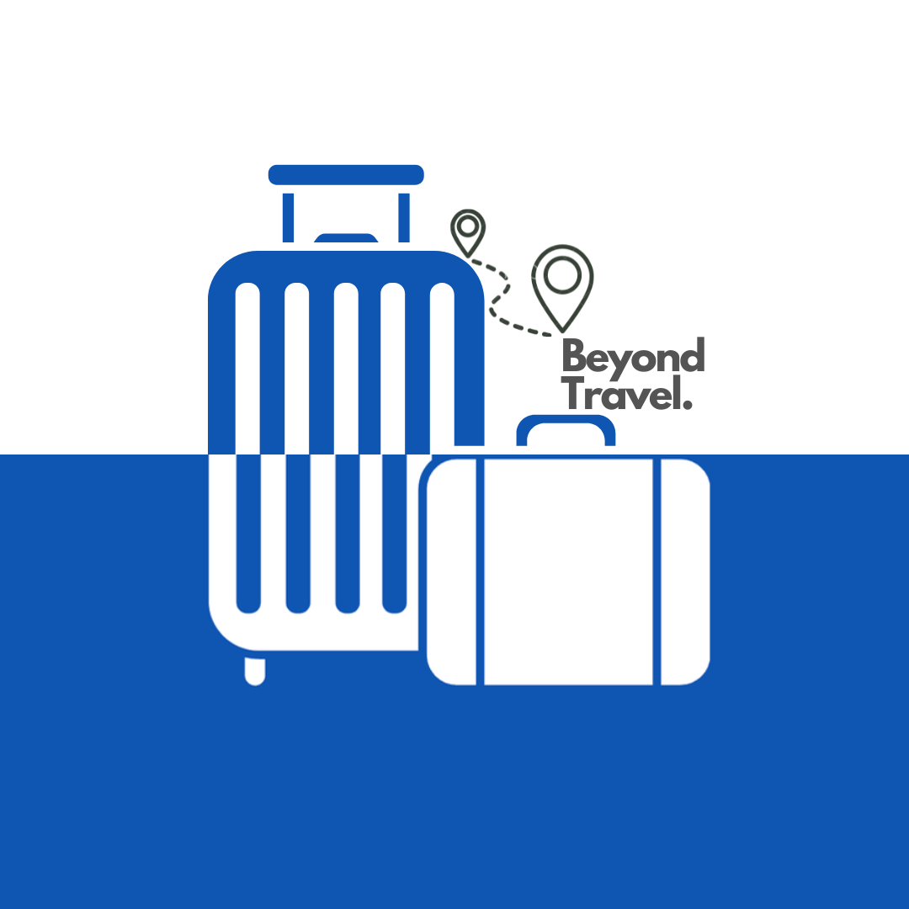

# Travel-and-Tours
# Beyond Travel - Travel Website



## Overview

Beyond Travel is an inspiring and immersive website dedicated to travelers, adventurers, and culture enthusiasts. It serves as a one-stop platform for exploring breathtaking destinations, discovering unique cultures, and planning unforgettable journeys.

## Features

- **Responsive Design**: Fully responsive layout that works on desktops, tablets, and mobile phones
- **Dark/Light Mode**: Toggle between dark and light themes for comfortable viewing
- **Interactive Navigation**: Smooth scrolling navigation with mobile-friendly menu
- **Search Functionality**: Search for destinations and travel packages
- **Destination Showcase**: Featured popular destinations with ratings and descriptions
- **Travel Packages**: Highlighted travel packages with pricing and details
- **Photo Gallery**: Display of traveler photos from various destinations
- **Newsletter Subscription**: Email signup for travel updates and news
- **Contact Form**: Easy contact options for inquiries
- **Social Media Integration**: Connect with social media platforms

## Technologies Used

- HTML5
- CSS3 (with CSS Variables for theming)
- JavaScript (Vanilla JS with no dependencies)
- Ionicons for icons

## Project Structure

```
beyond-travel/
├── images/               # Contains all website images
├── index.html            # Main HTML file
├── style.css             # Main stylesheet
├── script.js             # JavaScript functionality
└── README.md             # Project documentation
```

## Key Sections

1. **Hero Section**: Eye-catching banner with call-to-action buttons
2. **Tour Search**: Form to search for specific travel options
3. **Popular Destinations**: Showcase of trending travel locations
4. **Packages**: Featured travel packages with pricing
5. **Gallery**: Photo collection from travelers
6. **Contact**: Call-to-action for contacting the agency
7. **Footer**: Contact information, subscription form, and navigation links

## Special Features

- **Theme Toggle**: Switch between light and dark modes
- **Search Modal**: Interactive search functionality
- **Responsive Navigation**: Mobile-friendly navigation system
- **Scroll-to-Top Button**: Easy navigation back to top
- **Hover Effects**: Interactive elements with smooth transitions
- **Personalized Recommendations**: "Bela's Favorite Destinations" section

## Setup and Installation

1. Clone the repository
2. Open `index.html` in any modern web browser
3. No additional setup or dependencies required

## Customization

- **Colors**: Modify CSS variables in `:root` selector in style.css
- **Images**: Replace images in the images folder
- **Content**: Update text and descriptions in index.html

## Browser Compatibility

- Chrome (latest)
- Firefox (latest)
- Safari (latest)
- Edge (latest)
- Opera (latest)

## Future Enhancements

- User authentication system
- Booking functionality
- Payment gateway integration
- User reviews and ratings
- Interactive maps for destinations

## Credits

- Icons: [Ionicons](https://ionicons.com/)
- Fonts: [Google Fonts](https://fonts.google.com/) (Montserrat, Poppins)
- Images: Sample travel destination photos

---

Created with ❤️ for travel enthusiasts worldwide.
